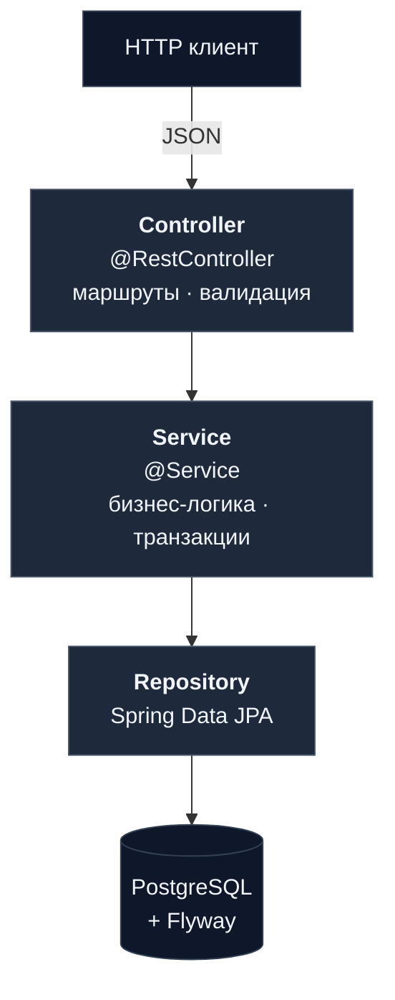
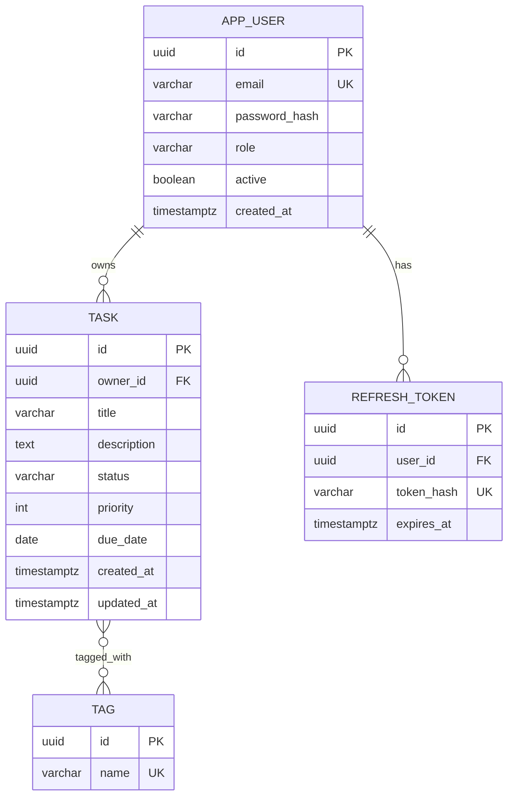

# Task Tracker

REST API для трекера задач на Spring Boot 3 — пользователи, JWT-аутентификация, роли, задачи с тегами, статусами и приоритетами, пагинация и фильтрация.


---

## Содержание

- [Возможности](#возможности)
- [Стек технологий](#стек-технологий)
- [Архитектура](#архитектура)
- [Доменная модель](#доменная-модель)
- [Как запустить](#как-запустить)
- [API](#api)
- [Тесты](#тесты)
- [Структура проекта](#структура-проекта)
- [Фронтенд](#фронтенд)
- [Roadmap](#roadmap)

---

## Возможности

- REST API с валидацией входных данных
- JWT-аутентификация: access-токен (15 мин) + refresh-токен (30 дней)
- Регистрация, логин, обновление токенов, выход
- Роли `USER` и `ADMIN`: админ видит всех пользователей и может менять им роль
- Каждый пользователь работает только со своими задачами; админ может смотреть чужие
- Задачи с тегами, статусами (`TODO` / `IN_PROGRESS` / `DONE`), приоритетом (1–5) и сроком
- Фильтрация задач по статусу и тегу + пагинация и сортировка
- Миграции БД через Flyway
- Запуск одной командой через Docker Compose

---

## Стек технологий

| Слой | Технология |
|---|---|
| Язык / сборка | Java 23, Gradle 8 (Kotlin DSL) |
| Web | Spring Boot 3.4, Spring MVC, Bean Validation |
| Безопасность | Spring Security, jjwt 0.12, BCrypt |
| Persistence | Spring Data JPA, Hibernate, PostgreSQL 16 |
| Миграции | Flyway 10 |
| Документация API | springdoc-openapi (Swagger UI) |
| Тесты | JUnit 5, Mockito, AssertJ, Spring MockMvc |
| Упаковка | Docker, Docker Compose |

---

## Архитектура

Трёхслойный монолит: контроллеры принимают запросы, сервисы содержат бизнес-логику, репозитории работают с БД.



**Ключевые компоненты:**

- `JwtAuthFilter` — проверяет JWT-токен из заголовка `Authorization: Bearer …` и сохраняет данные пользователя в контекст безопасности.
- `SecurityConfig` — настраивает Spring Security: что доступно без логина (`/api/auth/**`, Swagger), а что требует токен.
- `GlobalExceptionHandler` — превращает исключения в JSON-ответы с понятным форматом (status, code, detail).

---

## Доменная модель



- Один пользователь — много задач (`@OneToMany`).
- Задачи и теги связаны многие-ко-многим через таблицу `task_tag` (`@ManyToMany`).
- Refresh-токены хранятся в виде хеша, не в открытом виде.

---

## Как запустить

**Требования:** Docker Desktop, JDK 23.

```powershell
# 1. Скопировать шаблон конфигурации и заполнить реальные значения
cp .env.example .env
# открой .env и подставь APP_JWT_SECRET (любая длинная случайная строка, минимум 32 символа)

# 2. Собрать jar
.\gradlew clean bootJar

# 3. Поднять Postgres + приложение
docker compose up --build -d

# 4. Смотреть логи, пока не появится "Started MiniTasksApplication"
docker compose logs -f app
```

После старта:

| URL | Назначение |
|---|---|
| http://localhost:8080/ | Демонстрационный фронтенд |
| http://localhost:8080/swagger-ui/index.html | Swagger UI |
| http://localhost:8080/actuator/health | Health-проверка |

**Готовый admin для локальной отладки:**

- email: `admin@minitasks.local`
- password: `password`

**Остановить:**

```powershell
docker compose down       # сохранить БД
docker compose down -v    # удалить БД вместе с контейнерами
```

---

## API

### Эндпоинты

| Method | Path | Auth |
|---|---|---|
| POST | `/api/auth/register` | public |
| POST | `/api/auth/login` | public |
| POST | `/api/auth/refresh` | public |
| POST | `/api/auth/logout` | bearer |
| GET | `/api/users/me` | bearer |
| GET | `/api/users` | `ADMIN` |
| PATCH | `/api/users/{id}/role` | `ADMIN` |
| GET | `/api/tasks` | bearer |
| POST | `/api/tasks` | bearer |
| GET | `/api/tasks/{id}` | owner / `ADMIN` |
| PATCH | `/api/tasks/{id}` | owner / `ADMIN` |
| DELETE | `/api/tasks/{id}` | owner / `ADMIN` |
| POST | `/api/tasks/{id}/tags` | owner / `ADMIN` |
| DELETE | `/api/tasks/{id}/tags/{tagName}` | owner / `ADMIN` |
| GET | `/actuator/health` | public |

`GET /api/tasks` принимает query-параметры: `status`, `tag`, `page`, `size`, `sort`.

Все ошибки возвращаются в едином формате:

```json
{
  "title": "Forbidden",
  "status": 403,
  "detail": "You cannot access this task",
  "code": "TASK_FORBIDDEN"
}
```

### Быстрая демонстрация через curl

```bash
# Регистрация и логин
curl -s -X POST http://localhost:8080/api/auth/register \
  -H 'Content-Type: application/json' \
  -d '{"email":"alice@example.com","password":"Password1"}'

TOKEN=$(curl -s -X POST http://localhost:8080/api/auth/login \
  -H 'Content-Type: application/json' \
  -d '{"email":"alice@example.com","password":"Password1"}' | jq -r .accessToken)

# Создание задачи с тегами
curl -X POST http://localhost:8080/api/tasks \
  -H "Authorization: Bearer $TOKEN" \
  -H 'Content-Type: application/json' \
  -d '{"title":"Buy milk","priority":2,"tags":["home","urgent"]}'

# Фильтрация и пагинация
curl -H "Authorization: Bearer $TOKEN" \
  "http://localhost:8080/api/tasks?status=TODO&tag=home&size=10&sort=priority,desc"
```

---

## Тесты

```powershell
.\gradlew test
```

21 тест, ~10 секунд.

| Класс | Что проверяет |
|---|---|
| `JwtServiceTest` | Создание и парсинг JWT, истечение токена |
| `TaskServiceTest` | Бизнес-правила: владелец задачи, переходы статусов, обработка not-found |
| `AuthControllerTest` | HTTP-контракт регистрации/логина, валидация, неверный пароль → 401 |
| `TaskControllerTest` | Создание/получение задач, валидация, проверка доступа |

HTML-отчёт: `build/reports/tests/test/index.html`.

---

## Структура проекта

```
src/main/java/com/example/minitasks
├── MiniTasksApplication.java          # точка входа
├── config/
│   ├── SecurityConfig.java            # настройка Spring Security
│   ├── JwtProperties.java             # параметры JWT из application.yml
│   └── OpenApiConfig.java             # настройка Swagger
├── auth/
│   ├── AuthController.java
│   ├── AuthService.java
│   ├── JwtService.java                # выпуск и проверка JWT
│   ├── JwtAuthFilter.java             # фильтр для проверки токена
│   ├── RefreshToken.java
│   └── dto/
├── user/
│   ├── User.java   Role.java
│   ├── UserRepository.java
│   ├── UserService.java
│   └── UserController.java
├── task/
│   ├── Task.java   TaskStatus.java   Tag.java
│   ├── TaskRepository.java
│   ├── TaskService.java
│   └── TaskController.java
└── common/
    ├── GlobalExceptionHandler.java    # единый формат ошибок
    ├── Email.java   PasswordPolicy.java
    └── exceptions/

src/main/resources
├── application.yml
├── db/migration/
│   ├── V1__init_schema.sql
│   └── V2__seed_admin.sql
└── static/                            # фронтенд (см. ниже)
    ├── index.html   app.css   app.js
```

---

## Фронтенд

Минимальный фронт на **vanilla JS + HTML + CSS** лежит в `src/main/resources/static/`. Spring Boot отдаёт его с корня (`/`). Сделан для интерактивной демонстрации API без необходимости использовать Postman или Swagger.

---

## Roadmap

Что хотел бы добавить:

1. **Защита от перебора пароля** — ограничение попыток логина по IP и блокировка аккаунта после нескольких подряд неудачных входов.
2. **Интеграционные тесты** с Testcontainers для полного сценария через HTTP.
3. **Деплой на бесплатный хостинг** для живой демонстрации.
4. **Postman-коллекция** в репозитории.
5. **Логи в JSON** для удобного просмотра.
